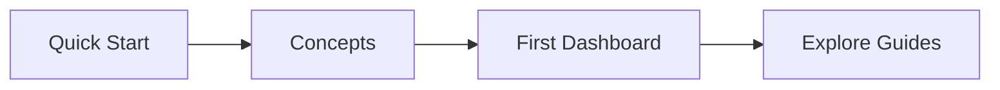

# Getting Started with NovaSight

Welcome to NovaSight! This section will help you get up and running with the platform quickly.

## What You'll Learn

In this section, you'll learn:

1. **[Quick Start](quick-start.md)** - Set up your first data connection and dashboard in minutes
2. **[Core Concepts](concepts.md)** - Understand the key concepts behind NovaSight
3. **[Your First Dashboard](first-dashboard.md)** - Build a complete dashboard step-by-step

## Prerequisites

Before you begin, make sure you have:

- [ ] A NovaSight account (sign up at your organization's portal)
- [ ] Access credentials to at least one data source
- [ ] A modern web browser (Chrome, Firefox, Safari, or Edge)

## Recommended Path

If you're new to NovaSight, we recommend following this path:

1. Start with the **Quick Start** guide to get a feel for the platform
2. Read about **Core Concepts** to understand how everything fits together
3. Follow the **First Dashboard** tutorial for a hands-on experience
4. Explore the detailed **Guides** for specific features

## Time Investment

| Guide | Time | Description |
|-------|------|-------------|
| Quick Start | 10 min | Minimal setup to see NovaSight in action |
| Concepts | 15 min | Understanding the platform architecture |
| First Dashboard | 30 min | Complete hands-on tutorial |

## Need Help?

If you get stuck at any point:

- Check the [Troubleshooting](../troubleshooting/common-issues.md) guide
- Review the [FAQ](../troubleshooting/faq.md)
- Contact your organization's NovaSight administrator

---

Ready to begin? Start with the [Quick Start Guide](quick-start.md) →
