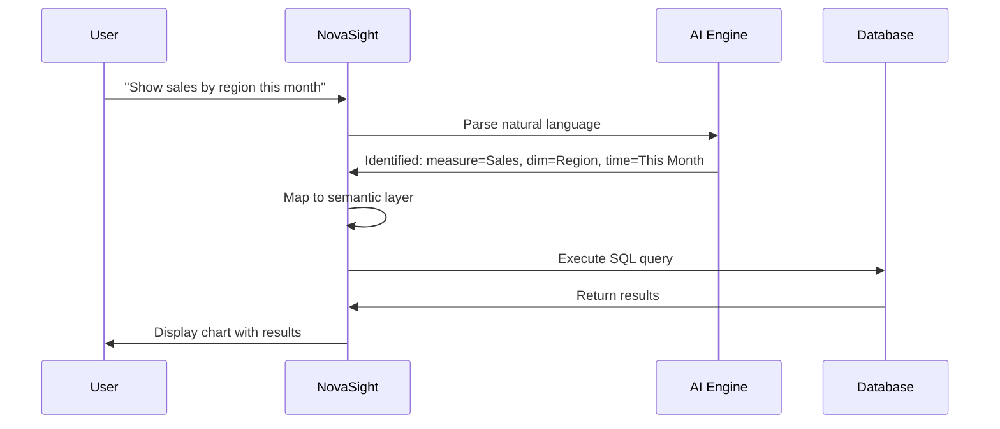

# Core Concepts

Understanding these core concepts will help you get the most out of NovaSight.

## Architecture Overview

NovaSight is built on a modern, multi-tenant architecture designed for scalability and security.

```
┌────────────────────────────────────────────────────────────────┐
│                         Your Browser                           │
│                      (React Frontend)                          │
└─────────────────────────────┬──────────────────────────────────┘
                              │
                              ▼
┌────────────────────────────────────────────────────────────────┐
│                       NovaSight API                            │
│                     (Flask Backend)                            │
├────────────────────────────────────────────────────────────────┤
│  ┌──────────────┐  ┌──────────────┐  ┌──────────────────────┐  │
│  │ Auth Service │  │ Query Engine │  │   AI/NL2SQL Engine   │  │
│  └──────────────┘  └──────────────┘  └──────────────────────┘  │
└────────────────────────────────────────────────────────────────┘
                              │
          ┌───────────────────┼───────────────────┐
          ▼                   ▼                   ▼
┌──────────────────┐ ┌──────────────────┐ ┌──────────────────┐
│   PostgreSQL     │ │    ClickHouse    │ │  Your Data       │
│   (Metadata)     │ │   (Analytics)    │ │  Sources         │
└──────────────────┘ └──────────────────┘ └──────────────────┘
```

---

## Key Concepts

### 1. Tenants

NovaSight is a **multi-tenant** platform. Each tenant represents an organization with:

- Isolated data and configurations
- Separate user management
- Independent billing and quotas
- Custom branding options

!!! info "Your Tenant"
    When you log in, you're automatically connected to your organization's tenant. All data and settings are isolated from other tenants.

---

### 2. Data Sources

A **Data Source** is a connection to your data:

```yaml
Data Source Types:
  Databases:
    - PostgreSQL
    - MySQL
    - ClickHouse
    - SQL Server
  Cloud Storage:
    - Amazon S3
    - Google Cloud Storage
    - Azure Blob Storage
  APIs:
    - REST APIs
    - GraphQL endpoints
```

**Key Properties:**
- **Connection String**: How to reach the data source
- **Credentials**: Authentication information
- **Schema**: Tables, columns, and relationships
- **Sync Schedule**: How often to refresh metadata

---

### 3. Semantic Layer

The **Semantic Layer** is the heart of NovaSight. It translates technical database schemas into business-friendly terms.

```
Database Schema                    Semantic Layer
─────────────────                  ──────────────
tbl_ord.ord_amt         →         Total Sales
tbl_cust.cust_nm        →         Customer Name
tbl_prod.cat_id         →         Product Category
```

#### Models

A **Model** groups related semantic definitions:

```yaml
Model: Sales Analytics
  Tables:
    - orders
    - customers
    - products
  
  Dimensions:
    - Customer Name
    - Product Category
    - Region
    - Order Date
  
  Measures:
    - Total Sales
    - Order Count
    - Average Order Value
```

#### Dimensions

**Dimensions** are attributes you group or filter by:

| Type | Example | Description |
|------|---------|-------------|
| Categorical | Region, Category | Text-based grouping |
| Temporal | Order Date, Month | Time-based analysis |
| Hierarchical | Country > State > City | Drill-down capable |

#### Measures

**Measures** are quantitative values you calculate:

| Type | Example | Aggregation |
|------|---------|-------------|
| Additive | Total Sales | SUM, COUNT |
| Semi-Additive | Account Balance | AVG, LAST |
| Non-Additive | Profit Margin | Calculated |

#### Relationships

**Relationships** define how tables connect:

```sql
customers.id → orders.customer_id  (one-to-many)
orders.product_id → products.id    (many-to-one)
```

---

### 4. Natural Language Queries

NovaSight uses **AI** to understand your questions:

```
Your Question          →    AI Engine    →    SQL Query    →    Results
─────────────────          ───────────        ──────────        ───────
"Top 10 customers         NL2SQL +           SELECT ...         Table +
 by revenue last          Semantic           FROM ...           Chart
 quarter"                 Layer              ORDER BY ...
```

**How It Works:**

1. **Parse**: Understand the intent and entities
2. **Map**: Match to semantic layer definitions
3. **Generate**: Create optimized SQL
4. **Execute**: Run against the database
5. **Visualize**: Display in the best format

---

### 5. Dashboards

**Dashboards** are collections of widgets:

```
┌─────────────────────────────────────────────────────────────┐
│  📊 Sales Dashboard                              [Edit] [⋮] │
├─────────────────────────────────────────────────────────────┤
│  ┌─────────────────┐  ┌─────────────────┐  ┌─────────────┐  │
│  │ Revenue KPI     │  │ Monthly Trend   │  │ By Region   │  │
│  │    $1.2M        │  │ [Line Chart]    │  │ [Bar Chart] │  │
│  └─────────────────┘  └─────────────────┘  └─────────────┘  │
│  ┌──────────────────────────────────────┐  ┌─────────────┐  │
│  │         Top Customers Table          │  │ Filters     │  │
│  │  1. Acme Corp    $50,000            │  │ [Date]      │  │
│  │  2. TechCo       $45,000            │  │ [Region]    │  │
│  └──────────────────────────────────────┘  └─────────────┘  │
└─────────────────────────────────────────────────────────────┘
```

**Widget Types:**
- **KPI**: Single value with comparison
- **Chart**: Line, bar, pie, scatter, etc.
- **Table**: Tabular data display
- **Text**: Markdown-formatted text
- **Filter**: Interactive filter control

**Interactions:**
- **Cross-filtering**: Click on one widget to filter others
- **Drill-down**: Click to see more detail
- **Time controls**: Global date range selection

---

### 6. Pipelines (Data Sync)

**Pipelines** automate data synchronization:

```yaml
Pipeline: Daily Sales Sync
  Source: PostgreSQL (Production)
  Destination: ClickHouse (Analytics)
  Schedule: Every day at 2:00 AM
  
  Steps:
    1. Extract from source
    2. Transform with dbt
    3. Load to destination
    4. Refresh semantic layer
```

**Orchestration:**
- Powered by Apache Airflow
- Visual DAG monitoring
- Automatic retries and alerts

---

### 7. Security Model

NovaSight uses **Role-Based Access Control (RBAC)**:

```
                    ┌─────────────┐
                    │    Admin    │
                    │ (Full Access)│
                    └──────┬──────┘
                           │
          ┌────────────────┼────────────────┐
          ▼                ▼                ▼
   ┌─────────────┐  ┌─────────────┐  ┌─────────────┐
   │   Analyst   │  │  Developer  │  │   Viewer    │
   │(Create/Edit)│  │(API Access) │  │ (View Only) │
   └─────────────┘  └─────────────┘  └─────────────┘
```

**Key Security Features:**
- Row-level security (RLS)
- Column masking
- Audit logging
- SSO integration
- API key management

---

## Putting It All Together

Here's how a typical workflow looks:



---

## Glossary

| Term | Definition |
|------|------------|
| **Tenant** | An isolated organization within NovaSight |
| **Data Source** | A connection to external data |
| **Semantic Layer** | Business-friendly data definitions |
| **Model** | A collection of dimensions and measures |
| **Dimension** | An attribute for grouping data |
| **Measure** | A calculated metric |
| **Dashboard** | A collection of visualization widgets |
| **Widget** | A single visualization or control |
| **Pipeline** | An automated data synchronization job |
| **RBAC** | Role-Based Access Control |

---

## Next Steps

Now that you understand the concepts, try:

- [Building Your First Dashboard](first-dashboard.md)
- [Connecting Data Sources](../guides/data-sources/connecting-postgresql.md)
- [Creating Semantic Models](../guides/semantic-layer/dimensions-measures.md)
