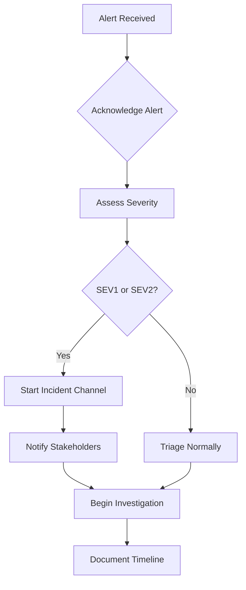

# NovaSight Incident Response Procedures

## Overview

This document outlines the incident response procedures for NovaSight, including detection, triage, mitigation, resolution, and post-incident activities.

## Table of Contents

1. [Incident Classification](#incident-classification)
2. [Detection & Alerting](#detection--alerting)
3. [Response Procedures](#response-procedures)
4. [Communication](#communication)
5. [Common Incidents](#common-incidents)
6. [Post-Incident](#post-incident)
7. [Runbooks](#runbooks)

---

## Incident Classification

### Severity Levels

| Severity | Description | Response Time | Escalation Time | Examples |
|----------|-------------|---------------|-----------------|----------|
| **SEV1** | Complete outage or critical security incident | 15 minutes | Immediate | API completely down, data breach, data loss |
| **SEV2** | Major service degradation | 30 minutes | 1 hour | >50% users affected, authentication down |
| **SEV3** | Partial service degradation | 4 hours | 8 hours | Single feature broken, performance degraded |
| **SEV4** | Minor issue with workaround | 24 hours | Next sprint | UI bug, documentation error |

### Impact Assessment Matrix

| Users Affected | Critical Feature | Standard Feature | Low Priority |
|----------------|------------------|------------------|--------------|
| All users | SEV1 | SEV2 | SEV3 |
| >50% users | SEV2 | SEV2 | SEV3 |
| <50% users | SEV2 | SEV3 | SEV4 |
| Single tenant | SEV2 | SEV3 | SEV4 |
| Internal only | SEV3 | SEV4 | SEV4 |

---

## Detection & Alerting

### Alert Sources

| Source | Alerts | Severity |
|--------|--------|----------|
| Prometheus/Alertmanager | Infrastructure, application metrics | SEV1-3 |
| Grafana | Dashboard alerts, anomaly detection | SEV2-4 |
| PagerDuty | Aggregated alerts, on-call routing | All |
| Sentry | Application errors, exceptions | SEV2-4 |
| CloudFlare | DDoS, WAF, SSL issues | SEV1-2 |
| User Reports | Support tickets, Slack | SEV2-4 |

### Critical Alerts

```yaml
# Prometheus alert rules
groups:
- name: novasight-critical
  rules:
  - alert: APIDown
    expr: up{job="novasight-api"} == 0
    for: 1m
    labels:
      severity: critical
    annotations:
      summary: "NovaSight API is down"
      
  - alert: HighErrorRate
    expr: sum(rate(http_requests_total{status=~"5.."}[5m])) / sum(rate(http_requests_total[5m])) > 0.05
    for: 2m
    labels:
      severity: critical
    annotations:
      summary: "Error rate above 5%"
      
  - alert: HighLatency
    expr: histogram_quantile(0.95, sum(rate(http_request_duration_seconds_bucket[5m])) by (le)) > 2
    for: 5m
    labels:
      severity: warning
    annotations:
      summary: "P95 latency above 2 seconds"
```

---

## Response Procedures

### Initial Response (First 15 Minutes)



#### 1. Acknowledge Alert

```bash
# Acknowledge in PagerDuty (within SLA)
pd incident acknowledge <incident-id>

# Or via Slack bot
/pd ack <incident-id>
```

#### 2. Create Incident Channel

```bash
# Slack command to create incident channel
/incident create --severity SEV1 --title "API Outage" --commander @johndoe
```

**Channel naming**: `#inc-YYYYMMDD-short-description`

#### 3. Initial Assessment

```bash
# Quick health check
curl -s https://api.novasight.io/api/v1/health | jq .

# Check pod status
kubectl get pods -n novasight-prod

# Check recent events
kubectl get events -n novasight-prod --sort-by='.lastTimestamp' | tail -20

# Check logs
kubectl logs -l app=backend -n novasight-prod --tail=100 --since=5m
```

#### 4. Post Initial Update

```markdown
🚨 **Incident Started**
- **Time**: 2026-01-29 10:00 UTC
- **Severity**: SEV2
- **Impact**: API latency increased, affecting all users
- **Status**: Investigating
- **Commander**: @johndoe
- **Channel**: #inc-20260129-api-latency
```

### Investigation Phase

#### Gather Diagnostics

```bash
# Check all pods
kubectl get pods -n novasight-prod -o wide

# Check specific pod logs
kubectl logs -f <pod-name> -n novasight-prod --tail=200

# Check resource usage
kubectl top pods -n novasight-prod

# Check node resources
kubectl top nodes

# Check HPA status
kubectl get hpa -n novasight-prod

# Database connections
kubectl exec -it postgresql-0 -n novasight-prod -- \
  psql -U novasight -c "SELECT count(*), state FROM pg_stat_activity GROUP BY state;"

# Redis health
kubectl exec -it redis-0 -n novasight-prod -- redis-cli info | grep -E 'connected|memory|blocked'

# ClickHouse queries
kubectl exec -it clickhouse-0 -n novasight-prod -- \
  clickhouse-client --query "SELECT count(), elapsed FROM system.processes"
```

#### Check Dashboards

| Dashboard | URL | Purpose |
|-----------|-----|---------|
| Overview | `https://grafana.novasight.io/d/overview` | System health |
| API Metrics | `https://grafana.novasight.io/d/api-metrics` | Request rates, latency |
| Errors | `https://grafana.novasight.io/d/errors` | Error rates, types |
| Database | `https://grafana.novasight.io/d/database` | Query performance |
| Infrastructure | `https://grafana.novasight.io/d/infrastructure` | Node/pod resources |

### Mitigation Phase

#### Quick Mitigation Actions

| Issue | Mitigation |
|-------|------------|
| Pod crashes | `kubectl rollout restart deployment/<name>` |
| High latency | Scale up pods, check slow queries |
| Memory exhaustion | Restart pods, increase limits |
| Database overload | Kill long queries, scale replicas |
| Network issues | Check ingress, DNS, certificates |

```bash
# Restart deployment
kubectl rollout restart deployment/backend -n novasight-prod

# Scale up
kubectl scale deployment/backend --replicas=15 -n novasight-prod

# Rollback
kubectl rollout undo deployment/backend -n novasight-prod

# Kill problematic queries (PostgreSQL)
kubectl exec -it postgresql-0 -n novasight-prod -- \
  psql -U novasight -c "SELECT pg_terminate_backend(pid) FROM pg_stat_activity WHERE duration > interval '5 minutes' AND state = 'active';"
```

### Resolution Phase

#### Verify Fix

```bash
# Health check
curl -s https://api.novasight.io/api/v1/health | jq .

# Run smoke tests
npm run test:smoke:prod

# Check error rate
# In Grafana or via PromQL:
# sum(rate(http_requests_total{status=~"5.."}[5m])) / sum(rate(http_requests_total[5m]))

# Verify latency
# histogram_quantile(0.95, sum(rate(http_request_duration_seconds_bucket[5m])) by (le))
```

#### Close Incident

```markdown
🟢 **Incident Resolved**
- **Duration**: 45 minutes
- **Impact**: API latency affected ~30% of users for 45 minutes
- **Root Cause**: Database connection pool exhaustion due to long-running query
- **Resolution**: Killed long-running query, increased pool size
- **Follow-up**: Post-mortem scheduled for 2026-01-30 14:00 UTC
```

---

## Communication

### Status Page Updates

```bash
# Update status page
./scripts/post-status.sh \
  --status "investigating" \
  --component "API" \
  --message "We are investigating increased API latency"

# Status options: investigating, identified, monitoring, resolved
```

### Communication Templates

#### Initial Notification (SEV1/SEV2)

```markdown
**NovaSight Service Alert**

We are currently experiencing issues with [component].

**Impact**: [description of user impact]
**Status**: Investigating
**Started**: [timestamp]

We will provide updates every 30 minutes.
```

#### Update Template

```markdown
**Update [#]** - [timestamp]

**Status**: [investigating|identified|monitoring]
**Summary**: [what we know]
**Actions**: [what we're doing]
**ETA**: [if known]
```

#### Resolution Template

```markdown
**Resolved** - [timestamp]

The issue with [component] has been resolved.

**Duration**: [X hours Y minutes]
**Impact**: [description]
**Root Cause**: [brief summary]
**Resolution**: [what fixed it]

A post-mortem will be published within 48 hours.
```

### Escalation Matrix

| Time Since Start | SEV1 Action | SEV2 Action |
|------------------|-------------|-------------|
| 0 min | Page on-call | Page on-call |
| 15 min | Page team lead | - |
| 30 min | Page VP Eng | Page team lead |
| 60 min | Page CTO | Page VP Eng |
| 2 hours | Executive briefing | - |

---

## Common Incidents

### API Down (SEV1)

```bash
# 1. Check ingress
kubectl get ingress -n novasight-prod
kubectl describe ingress novasight-ingress -n novasight-prod

# 2. Check pods
kubectl get pods -l app=backend -n novasight-prod

# 3. Check logs
kubectl logs -l app=backend -n novasight-prod --tail=200

# 4. Check certificates
kubectl get certificates -n novasight-prod

# 5. Mitigation
kubectl rollout restart deployment/backend -n novasight-prod
```

### Database Connection Exhaustion

```bash
# 1. Check active connections
kubectl exec -it postgresql-0 -n novasight-prod -- \
  psql -U novasight -c "SELECT count(*) FROM pg_stat_activity;"

# 2. Find long-running queries
kubectl exec -it postgresql-0 -n novasight-prod -- \
  psql -U novasight -c "SELECT pid, now() - pg_stat_activity.query_start AS duration, query, state FROM pg_stat_activity WHERE (now() - pg_stat_activity.query_start) > interval '1 minute' ORDER BY duration DESC;"

# 3. Kill problematic queries
kubectl exec -it postgresql-0 -n novasight-prod -- \
  psql -U novasight -c "SELECT pg_terminate_backend(pid) FROM pg_stat_activity WHERE duration > interval '5 minutes';"

# 4. Increase pool size if needed
kubectl patch configmap pgbouncer-config -n novasight-prod \
  --patch '{"data":{"max_client_conn":"500"}}'
kubectl rollout restart deployment/pgbouncer -n novasight-prod
```

### High Memory Usage (OOMKilled)

```bash
# 1. Check which pods are being killed
kubectl get pods -n novasight-prod | grep -E 'OOMKilled|Error'

# 2. Check memory usage
kubectl top pods -n novasight-prod --sort-by=memory

# 3. Increase memory limits
kubectl patch deployment backend -n novasight-prod \
  --type='json' \
  -p='[{"op": "replace", "path": "/spec/template/spec/containers/0/resources/limits/memory", "value": "4Gi"}]'

# 4. Scale horizontally
kubectl scale deployment/backend --replicas=10 -n novasight-prod
```

### SSL Certificate Expiry

```bash
# 1. Check certificate status
kubectl get certificates -n novasight-prod

# 2. Check cert-manager logs
kubectl logs -l app=cert-manager -n cert-manager --tail=100

# 3. Force renewal
kubectl delete certificate novasight-tls -n novasight-prod
# cert-manager will automatically recreate

# 4. Verify new certificate
kubectl get certificates -n novasight-prod
```

### Redis Connection Issues

```bash
# 1. Check Redis status
kubectl exec -it redis-0 -n novasight-prod -- redis-cli ping

# 2. Check Redis info
kubectl exec -it redis-0 -n novasight-prod -- redis-cli info

# 3. Check connected clients
kubectl exec -it redis-0 -n novasight-prod -- redis-cli CLIENT LIST

# 4. Clear problem connections
kubectl exec -it redis-0 -n novasight-prod -- redis-cli CLIENT KILL TYPE normal

# 5. Restart if needed
kubectl rollout restart statefulset/redis -n novasight-prod
```

---

## Post-Incident

### Post-Mortem Timeline

| Timeframe | Activity |
|-----------|----------|
| Within 24 hours | Create post-mortem document |
| Within 48 hours | Hold post-mortem meeting |
| Within 1 week | Action items assigned |
| Within 2 weeks | Follow-up on action items |

### Post-Mortem Template

```markdown
# Incident Post-Mortem: [Title]

## Summary
- **Date**: YYYY-MM-DD
- **Duration**: X hours Y minutes
- **Severity**: SEV[1-4]
- **Impact**: [user impact description]
- **Author**: [name]

## Timeline
| Time (UTC) | Event |
|------------|-------|
| HH:MM | Initial alert triggered |
| HH:MM | On-call acknowledged |
| HH:MM | Root cause identified |
| HH:MM | Fix deployed |
| HH:MM | Incident resolved |

## Root Cause
[Detailed technical explanation]

## Impact
- X users affected
- Y failed requests
- Z minutes of degraded service

## What Went Well
- [List positives]

## What Went Wrong
- [List issues]

## Action Items
| Action | Owner | Due Date | Status |
|--------|-------|----------|--------|
| [action] | [name] | YYYY-MM-DD | Open |

## Lessons Learned
- [Key takeaways]
```

---

## Runbooks

Quick links to detailed runbooks for common scenarios:

- [Database Recovery](../backup/docs/RECOVERY_RUNBOOK.md)
- [Deployment Rollback](deployment-runbook.md#rollback-procedures)
- [Scaling Operations](scaling-guide.md)
- [Disaster Recovery](disaster-recovery.md)
- [Security Incident Response](security-incident-response.md)

---

## Related Documents

- [Deployment Runbook](deployment-runbook.md)
- [Scaling Guide](scaling-guide.md)
- [Disaster Recovery](disaster-recovery.md)
- [On-Call Handbook](on-call-handbook.md)
